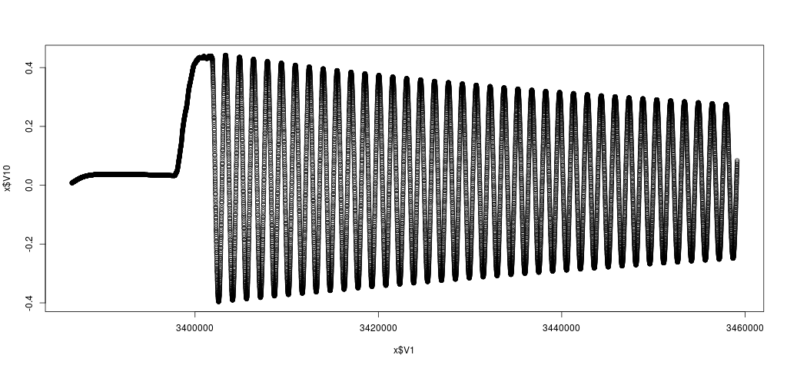
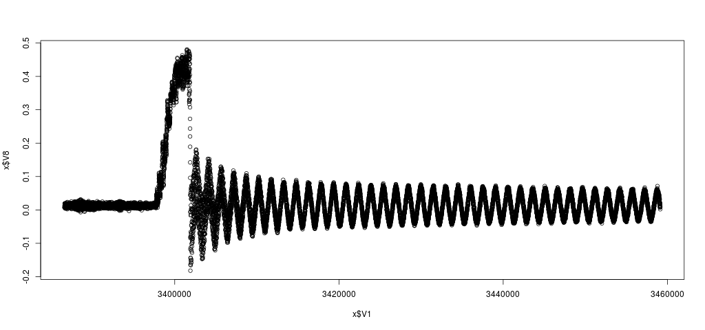

# What is BlueIMU?

BlueIMU is an Inertial Measurement Unit (IMU) with 6 degrees of freedom and Bluetooth connectivity (serial port profile / SPP). 

The main features of BlueIMU are:

* Based on inexpensive, easily available hardware components, namely, the 6 degrees of freedom GY521 IMU module featuring an InvenSense MPU-6050 sensor, the HC06 Bluetooth module, and an Atmega328P microcontroller. 
* Runs from a single cell LiPo battery. An overdischarge protection is included in the design. 
* Raw sensor values can be transmitted at sampling rates of 200 Hz and higher through a 230400 Baud wireless serial connection (Bluetooth SPP).
* The BlueIMU software is based on the Arduino IDE and can be easily modified.
* Fully open source hardware (circuit board / PCB) and software design.
* Sample application with Kalman filter for calculating attitude (pitch and roll) included. 

The following image shows the BlueIMU board. The GY521 IMU module is the little blue board on the left; the green board is the HC06 Bluetooth module.


Note that BlueIMU uses a 6 degrees of freedom IMU with a 3 axes accelerometer and 3 axes gyroscope, but without a magnetometer (compass). This is sufficient for sensing the pitch and roll, for instance, for controlling the attitude of a drone. However, we cannot sense the yaw to navigate a drone. However, the design could be easily adapted to use a 9 degrees of freedom IMU such as the InvenSense MPU-9250 on the GY-9250 module (GY521 and GY-9250 both use I2C for connecting to the MCU, but the GY-9250 requires 10 instead of 8 header pins to connect to the BlueIMU board).
 
# Why Yet Another IMU?

Many wireless IMUs today are based on Bluetooth Low Energy (BLE). Although BLE is optimized for very low energy consumption, it lacks support for higher data rates and low latency as required by sensors at higher sampling rates. In particular, the minimum connection interval of 7.5 ms inherently limits the sampling rate of wireless BLE sensors to about 133 Hz, and together with the small frames of only 20 bytes payload, the data rate is limited. Therefore, BLE is a great technology if you strive for years of battery lifetime at moderate data rates, however, for higher data rates and sensor sampling rates, standard Bluetooth is the better choice.

Therefore, BlueIMU uses standard Bluetooth supporting higher data rates (230400 Baud serial connection) to allow for higher sensor sampling rates at 200 Hz and higher.

# Hardware Design

The design of the BlueIMU circuit board (PCB) can be found in folder `pcb` (Eagle schematics and board design as well as Gerber files for production at a PCB house are included). 
  
BlueIMU is based on easily available low-cost components such as the GY521 IMU featuring a 6 degrees of freedom (3x accelerometer, 3x gyroscope) InvenSense MPU-6050 sensor, a HC06 Bluetooth module, and an Atmega328P microcontroller (MCU), which is well-supported by the popular Arduino platform.

The following images shows the schematic of the BlueIMU board.


The Atmega328P MCU runs at 7.3728 MHz to allow for a perfect timing of the 230400 Baud serial connection to the HC06 Bluetooth module (230400 = 7.3728 MHz/32). Besides the serial connection, the HC06 module signals the Bluetooth connection state through a pin changing with a period of 750 ms while not connected and being constantly high while connected. Note that you need to porgram the HC06 module to use 230400 Baud using AT commands sent via the (wired) serial connection to the module (details can be found in the HC06 documentation).

A 6 pin connector is used to connect an in-system programmer with the following common pinout:

```
MISO <-- 1 2 --> VCC
SCK <--  3 4 --> MOSI
RST <--  5 6 --> GND
```

The GY521 module is connected through I2C to the MCU. It is soldered to the BlueIMU board using a 8 pin header providing for a rigid physical connection of the IMU to the BlueIMU board.

An overdischarge protection is included using the MAXIM ICL7665 voltage monitor. The MCU, IMU, and Bluetooth module will be disconnected from power at about 3.0 V. At about 3.3 V, the red LED (charge indicator) goes off to signal a low battery (the GY521 module has another onboard LED to show that the board is still running down to 3.0 V).  

## Preparing the Atmega328P (Programming Fuses)

Program the following fuses (note that "1" means fuse *not* programmed; "0" means fuse programmed):
  
* CKSEL = 1101, SUT 01: external crystal oscillator 3-8 MHz with fast startup times (BOD is enabled).
* CKDIV8 = 1: don't divide clock internally by 8.
* SPIEN = 0: enable serial programming.
* BODLEVEL = 101: brown-out detection set to 2.7 V.
* BOOTRST = 1: boot reset vector not enabled.
* RSTDISBL = 1: external reset not disabled.

This results in the following fuse bytes: 

* Low = 0xDD
* High = 0xD9
* Extended = 0x05

The MCU can be programmed using avrdude as follows:

```
$ sudo avrdude -c usbasp -p m328p -U lfuse:w:0xdd:m -U hfuse:w:0xd9:m -U efuse:w:0x05:m
```

## Flashing the Raw Transmitter Software

In folder `src/transmitter-raw` you find the raw transmitter software, which programs the BlueIMU to transmit raw measurements from the 3 axes accelerometer and 3 axes gyroscope of the MPU6050 IMU via Bluetooth serial profile (SPP). This software is implemented for the Arduino platform (tested with Arduino IDE 1.6.6) using the MPU6050 and I2C libraries by Jeff Rowberg.

In folder `arduino_board_definition` you find the corresponding board definition for the Atmega328P MCU running at 7.3728 MHz. Copy this directory into the folder `hardware` in your Arduino sketchbook.

Then, compile the Arduino sketch from folder `src/transmitter-raw`. This generates a hex file for the Atmega328P MCU. This hex file is a little bit hidden in the temporary build directory of the Arduino IDE. If you use Linux  and Arduino IDE 1.6, have a look at the `/tmp`  directory. After hitting the  compile button in the Arduino IDE, search for the latest hex file called  `transmitte-raw.cpp.hex` in a temporary directory named `/tmp/build...`. If you have found the hex file, you can flash it using avrdude:

```
$ sudo avrdude -p m328p -c usbasp -v -U flash:w:transmitter-raw.cpp.hex
```

## Data Format

Raw sensor data is transmitted over a Bluetooth serial connection. The transmitted data stream consists of records of the following format:

* Byte 0..1: Start of Record: 0x5A, 0xA5
* Byte 2..3: accelerometer X (16 bit signed int)  
* Byte 4..5: accelerometer Y (16 bit signed int)
* Byte 6..7: accelerometer Z (16 bit signed int)
* Byte 8..9: gyro X (16 bit signed int)
* Byte 10..11: gyro Y (16 bit signed int)
* Byte 12..13: gyro Z (16 bit signed int)
* Byte 14..17: sample time stamp (32 bit unsigned integer) in milliseconds since boot time
* Byte 18..19: 16 bit checksum

All 16 bit words are transmitted in Big Endian format (high byte first, low byte second). 

## Interpreting Raw Values

Values from sensors are transmitted as raw signed 16 bit values. The values can be translated to g and deg/s, respectively, depending on the configured sensor sensitivities (+-2g, +-4g, +-8g, +-16g; +-250 deg/s, +-500 deg/s, +- 1000 deg/s, +-2000 deg/s). The following resolutions are supported by the MPU6050 IMU:

* accelerometer: 16384, 8192, 4096, 2048 LSB / g
* gyro: 131, 65.5, 32.8, and 16.5 LSB / (deg/s) 

Please have a look at the manual of the MPU6050 for further details.

## Checksum 

The checksum consists of the ones' complement of the ones' complement sum of the 16-bit words, similar to the calculation of the checksum of IP headers. For detailed information on how to calculate the checksum, please have a look at the code. 

## Sampling Rate

The sampling rate can be adjusted by the SAMPLING_PERIOD definition.

## Low-pass Filter

The MPU 6050 features a low-pass filter. You can set the filter by defining DLPF according to the following table:

             |   ACCELEROMETER    |           GYROSCOPE
    DLPF_CFG | Bandwidth | Delay  | Bandwidth | Delay  | Sample Rate
    ---------+-----------+--------+-----------+--------+-------------
    0        | 260Hz     | 0ms    | 256Hz     | 0.98ms | 8kHz
    1        | 184Hz     | 2.0ms  | 188Hz     | 1.9ms  | 1kHz
    2        | 94Hz      | 3.0ms  | 98Hz      | 2.8ms  | 1kHz
    3        | 44Hz      | 4.9ms  | 42Hz      | 4.8ms  | 1kHz
    4        | 21Hz      | 8.5ms  | 20Hz      | 8.3ms  | 1kHz
    5        | 10Hz      | 13.8ms | 10Hz      | 13.4ms | 1kHz
    6        | 5Hz       | 19.0ms | 5Hz       | 18.6ms | 1kHz
    7        |   -- Reserved --   |   -- Reserved --   | Reserved

# Connecting a Linux Host to BlueIMU over Bluetooth

You can connect a Linux host to the BlueIMU board via Bluetooth as follows:

Step 1: Find the BlueIMU device 

```
$ hcitool scan
Scanning ...
	00:11:12:31:04:12	BlueIMU
```

Step 2: Pairing Linux host and BlueIMU device:

```
$ bluetooth-agent 1234 00:11:12:31:04:12
```

Step 3: Add device profile

```
$ sudo nano /etc/bluetooth/rfcomm.conf
```

Add the following section:

```
rfcomm1 {
  bind no;
  device 00:11:12:31:04:12;
  channel 1;
  comment "Blue IMU serial Port";
}
```

Connect host to BlueIMU device: 

```
$ rfcomm connect 1
```

Now, you should have a serial device called `/dev/rfcomm1` that you can open with your application. For instance, you can use screen to log data as follows:

```
$ screen -L /dev/rfcomm1
```

# Kalman Filter

In folder `src/receiver-attitude` you find a sample application for Linux implementing a Kalman filter to calculate the attitude (pitch and roll) and logging raw sensor values and Kalman filter values (pitch, roll, estimated gyro bias) to a file as comma-separate values. Note that the GY521 IMU does not feature a magnetometer (compass), thus, we cannot easily detect the absolute heading (yaw). 

You can compile this application with the following commands:

```
$ cd src/receiver-attitude
$ make 
```

Then you start it as follows:

```
$ ./receiver-attitude -d /dev/rfcomm1 -o out.csv
```

The Kalman filter uses the following equations:

State vector (phi is the angle; phidot is the angular velocity; bias is the bias of angular velocity (gyro bias)): 

```
    [ phi  ] 
x = [phidot]
    [ bias ] 
```

State equation:

```
x(k) = F(k)*x(k-1) + omega(k)
```

with

```
       [1 t_delta -t_delta]
F(k) = [0    1        0   ]
       [0    0        1   ]
```

This implementation assumes no control input model (B). Instead, a normally distributed random angular acceleration (phidotdot) is introduced modeling the effect of external forces like motors as part of the random process noise (omega):

```
           [t_delta**2/2]
omega(k) = [  t_delta   ] * phidotdot
           [     0      ]
```

Covariance matrix Q of normally distributed random process noise omega ~ N(0,Q):

```
Q = G*Gtrans*sigma_phidotdot**2 

    [t_delta**4/4  t_delta**3/2  0]                        [ 0 0 0 ]
  = [t_delta**3/2   t_delta**2   0] * sigma_phidotdot**2 + [ 0 0 0 ] * sigma_bias**2 
    [      0             0       0]                        [ 0 0 1 ]
```

Moreover, we assume that we can measure the angle from the IMU acceleration (phi_m) and the angular velocity (phidot_m) from the gyroscope. However, we cannot measure the gyro bias. Measurements are modeled as independent normally distributed random variables to account for measurement noise. The covariance matrix R of normally distributed random measuring noise v ~ N(0,R) is defined as:

```
    [sigma_phi_m**2         0         ]
R = 
    [     0          sigma_phidot_m**2]
```

Sample data of a stationary IMU and an IMU attached to a pendulum can be found in folder `sample-data`. 

The following plot shows the angle of a pendulum in radians over time as calculated by the Kalman filter:



As a comparison, here the angle in radians over time calculated directly from the accelerometer without Kalman filter, i.e., without fusing measurements from accelerometer and gyroscope:



Observer how the angle calculated just from acceleration is only correct while the object is at rest and clearly wrong when the pendulum moves such that gravity cannot be easily distinguished anymore from the acceleration caused by centripetal force. In that case, the Kalman filter can use the angular velocity to predict the angle leading to much more accurate results.

# License

The BlueIMU software (contents of folders `src`) is licensed under the Apache License, Version 2.0.

The BlueIMU hardware documentation (contents of folder `pcb`) is licensed under the CERN Open Hardware Licence, Version 1.2

Both licenses are included in the repository in the files `LICENSE-SOFTWARE` and `LICENSE-HARDWARE`, respectively.

The BlueIMU software uses the I2Cdev device library and MPU-6050 code by Jeff Rowberg licensed under the MIT license.
